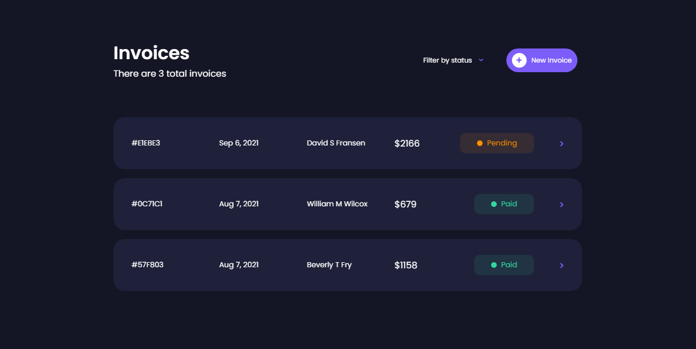

# Vuejs-TheInvoiceApp

A Simple vue application to facilitates invoice management



# Features

- Invoice Dashboard for invoice lists
- Invoice Detail
- Invoice Create
- Invoice Edit

## Installation

Clone the project. (https://github.com/mertaktas/Vuejs-TheInvoiceApp.git)

```
git clone https://github.com/mertaktas/Vuejs-TheInvoiceApp.git
```

## Usage

After cloning the project, open it in the IDE.

```
cd Vuejs-TheInvoiceApp
code .
```

## Project setup

Installation of the project

```
npm install
```

### Compiles and hot-reloads for development
```
npm run serve
```

### Compiles and minifies for production
```
npm run build
```

### Customize configuration
See [Configuration Reference](https://cli.vuejs.org/config/).

## License
[MIT](https://choosealicense.com/licenses/mit/)
